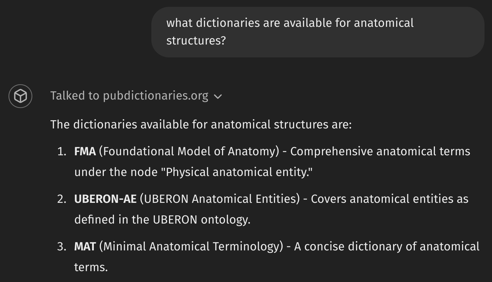
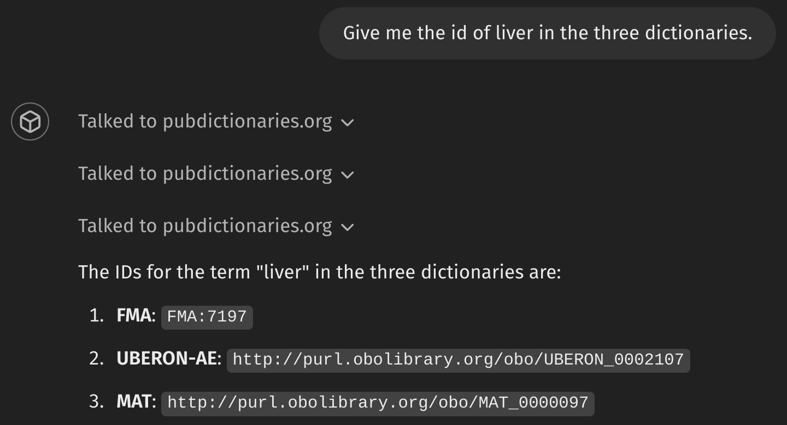
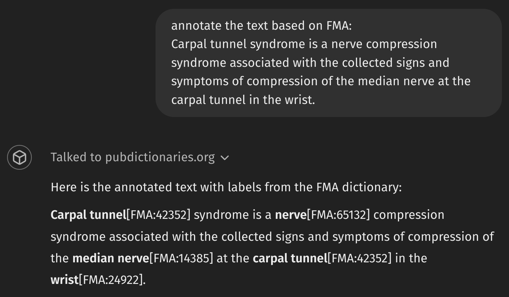
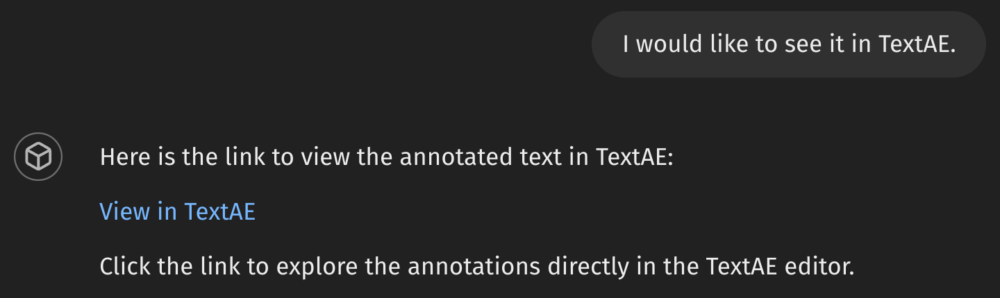
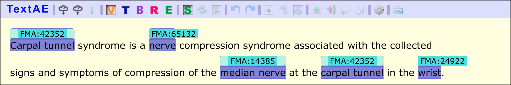

# Dictionarian Application and Extension

## About Dictionarian
- A project which began at BLAH8
  - *BioMedical Content Explorer* at that time
- A chat interface to utilize dictionaries.
- Implemented as a customized GPT, a.k.a. GPTS
- Access [PubDictionaries](https://pubdictionaries.org/) for dictionary resources. 
- Current state: anyone with the [link](https://chatgpt.com/g/g-6747c97a8bbc8191bde84c9c155c5e5f-dictionarian) can use it. (Not in the GPT store yet)

## Example Usage

Click to expand

### Search dictionaries

### Retrieve IDs

### Text Annotation

* Annotations are formatted in [Simple Inline Annotation Format](https://docs.google.com/document/d/1IElxZ0mADbsCI1tYvZhpts1OQZTWrVJvSLFHOmbi4E8/edit?usp=sharing).

### Open Annotation in TextAE

*To open the TextAE example, click [this link](https://textae.pubannotation.org/editor.html?mode=edit&annotation=%7B%22text%22%3A%22Carpal+tunnel+syndrome+is+a+nerve+compression+syndrome+associated+with+the+collected+signs+and+symptoms+of+compression+of+the+median+nerve+at+the+carpal+tunnel+in+the+wrist.%22%2C%22denotations%22%3A%5B%7B%22span%22%3A%7B%22begin%22%3A0%2C%22end%22%3A13%7D%2C%22obj%22%3A%22FMA%3A42352%22%7D%2C%7B%22span%22%3A%7B%22begin%22%3A28%2C%22end%22%3A33%7D%2C%22obj%22%3A%22FMA%3A65132%22%7D%2C%7B%22span%22%3A%7B%22begin%22%3A126%2C%22end%22%3A138%7D%2C%22obj%22%3A%22FMA%3A14385%22%7D%2C%7B%22span%22%3A%7B%22begin%22%3A146%2C%22end%22%3A159%7D%2C%22obj%22%3A%22FMA%3A42352%22%7D%2C%7B%22span%22%3A%7B%22begin%22%3A167%2C%22end%22%3A172%7D%2C%22obj%22%3A%22FMA%3A24922%22%7D%5D%7D).

## During BLAH9

- To Apply Dictionarian for annotation projects
  - HP Annotation
  - Plant Annotation
- Tp extend the scenario to include PubAnnotation for storage of annotation.
- To find and fill other gaps when found necessary.
